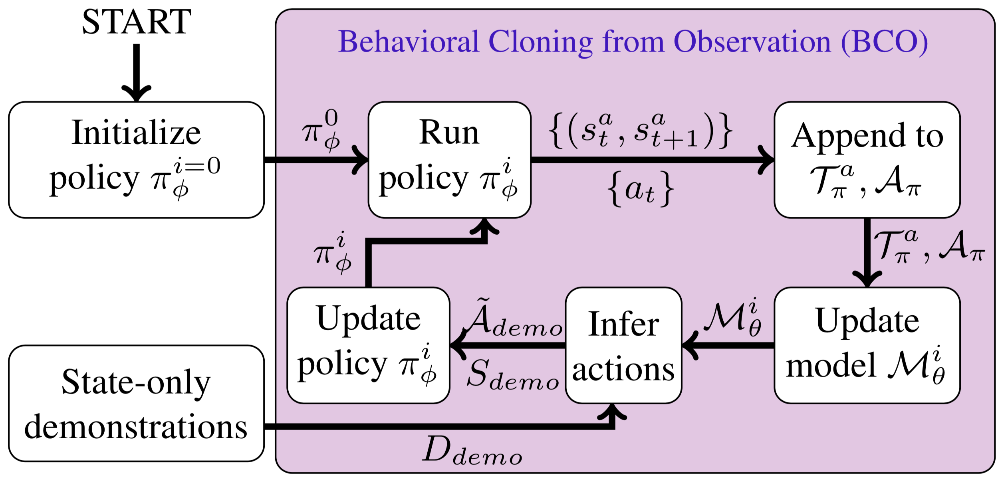
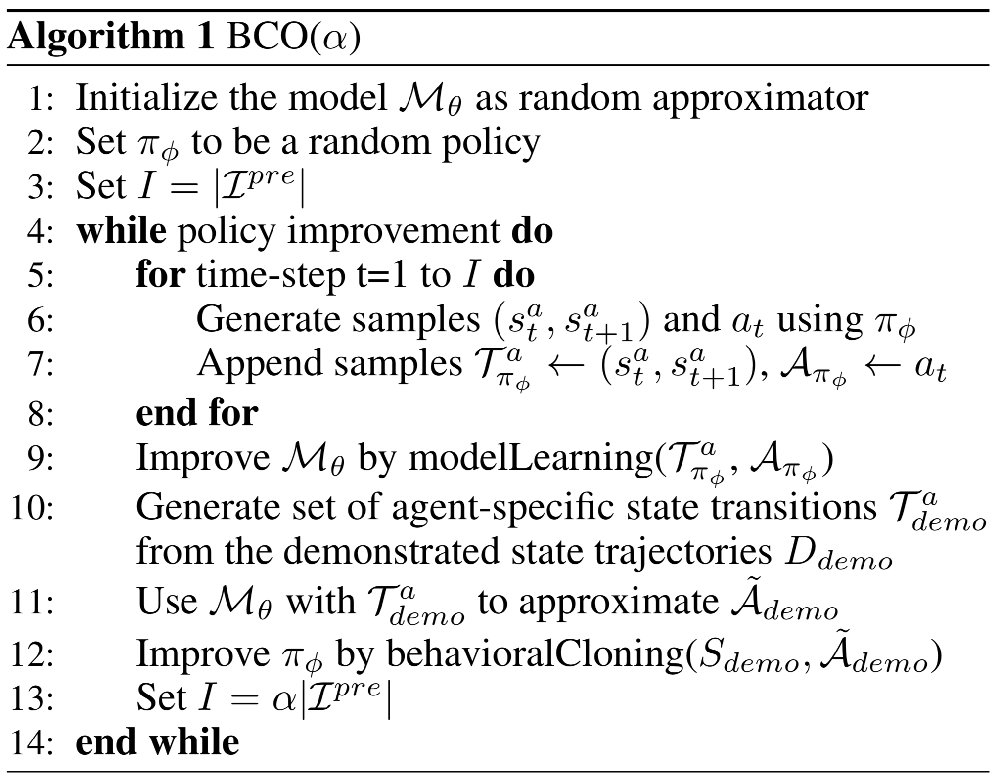

# Behavioral Cloning from Observation [[Paper]](https://arxiv.org/abs/1805.01954)

## Introduction

This is an implementation of BCO in Tensorflow on [cartpole](https://gym.openai.com/envs/CartPole-v0/) environment.

There are two phases in BCO: (1) Inverse dynamic model which experience in a self-supervised fashion. (2) Policy model which use behavioral cloning by observing the expert perform without actions and get the action by (1).



## Algorithm

As method above, there are two phases in BCO. In lines 5-9, phase 1, improving the inverse dynamic model. In lines 10-12, phase 2, improving the policy model by behavioral cloning.



## Training BCO

After collecting the observation of expert demonstration, you can then train BCO. The training script are in [scripts](https://github.com/jerrylin1121/BCO/tree/master/scripts) directory. Let's see how to train BCO on cartople:

```shell
./scripts/run_bco_cartpole.sh
# python3 models/bco_cartpole.py --mode=train --input_file=demonstration/cartpole/cartpole.txt --model_dir=model/cartpole/
```

List of Args:

```
--input_filename   - the demonstration inputs
--mode             - train or test
--model_dir        - where to save/restore the model
--maxits           - the number of training iteration
--M                - the number of post demonstration examples
--batch_size       - number of examples in batch
--lr               - initial learning rate for adam SGD
--save_freq        - save model every save_freq iterations, 0 to disable
--print_freq       - print reward and loss every print_freq iterations, 0 to disable
```

## Evaluation

Get your evaluation result by the testing script in scripts directory. Let's see the examples for evaluate BCO on cartpole:

```shell
./scripts/test_bco_cartpole.sh
# python3 models/bco_cartpole.py --mode=test --model_dir=model/cartpole/
```

## Training on your own dataset and architectures

### Prepare your own data

The representation expects trajectories to be in a text file in the form:

```
[state] [next_state]
```

Each line in the file represents an observation from `state` to `next_state`. The demonstration must be in a file that contains only of demonstrations of this form. See [demonstration](https://github.com/jerrylin1121/BCO/tree/master/demonstration) directory for examples.

### Using your own architecture

First in `__init__` function you could specific your own environment.

```python
self.env = gym.make('Cartpole-v0') # which could change to any of your environment.
```

Later you have to implement following function which is related to your model or interact with your own environment.

1. implement your model.

   [build_policy_model](https://github.com/jerrylin1121/BCO/tree/master/models/bco.py#L69) builds your own policy model

   [build_idm_model](https://github.com/jerrylin1121/BCO/tree/master/models/bco.py#L73) builds your own inverse dynamic model

2. interact with environment.

   [pre_demonstration](https://github.com/jerrylin1121/BCO/tree/master/models/bco.py#L90) uniform sample action to generate (s_t, s_t+1) and action pairs

   [post_demonstration](https://github.com/jerrylin1121/BCO/tree/master/models/bco.py#L94) uses policy to generate (s_t, s_t+1) and action pairs

   [eval_rwd_policy](https://github.com/jerrylin1121/BCO/tree/master/models/bco.py#L98) gets reward by evaluate the policy function

Implement the above function. See [bco_cartpole.py](https://github.com/jerrylin1121/BCO/tree/master/models/bco_cartpole.py) in [models](https://github.com/jerrylin1121/BCO/tree/master/models) directory for examples.

## Citation

```
@article{torabi2018behavioral,
  title={Behavioral Cloning from Observation},
  author={Torabi, Faraz and Warnell, Garrett and Stone, Peter},
  journal={arXiv preprint arXiv:1805.01954},
  year={2018}
}
```
